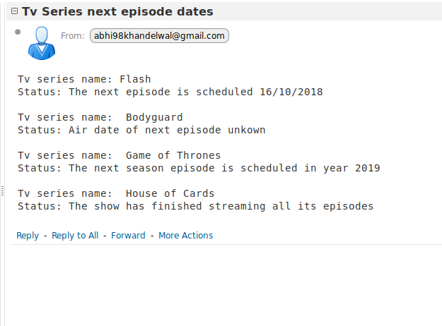

# Next Episode Time

A script designed to get an email about the next episode time of the given Tv series. The input gets stored in the MySQL database.

### Requirements
* Python 3.3 and up
* MySQL

## Setting up MySQL
1. Install MySQL by executing following commands in terminal.

```
$ sudo apt-get update
$ sudo apt-get install mysql-server
$ mysql_secure_installation
```
2. Change the user and password variables in `main.py` file according to the above configured MySQL.

## Setting up email
In `send_email.py` file set `username` to your gmail userid and set `password` to your gmail password.

## Installing dependencies on external python libraries
`$ pip install -r requirements.txt`
</br> or </br>
You can use the virtual environment in the repository. </br>
`$ source innovacer/bin/activate`

## Usage
`$ python main.py`

## Work Flow
1. Store the qurey in MySQL Database.
2. Get imdb id from https://www.imdb.com/find?q=<tv-series-name>
3. Check if the series have streamed all episodes or not. If no, then continue else give output.
4. Go to https://www.imdb.com/<id>/<episodes> url and scrape the date of next episode.
5. If all episodes have streamed of current season then scrape the date of next season from https://www.imdb.com/title/<id>/episodes?season=<next-season-number>.
6. Send the mail of gathered results. 

## Working Proof

Number of queries 1 </br>
Email address abhishekk16101@iiitnr.edu.in </br>
TV Series Flash, Game of Thrones, House of Cards 




## License
[MIT](https://choosealicense.com/licenses/mit/)
