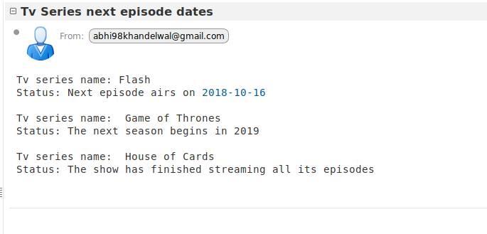

# Next Episode Time

A script designed to get an email about the next episode time of the given Tv series. The input gets stored in the MySQL database.

### Requirements
* Python 3.3 and up
* MySQL

## Setting up MySQL
1. Install MySQL by executing following commands in terminal.

```
$ sudo apt-get update
$ sudo apt-get install mysql-server
$ mysql_secure_installation
```

2. Create a database in MySQL. Below we create a database named innovacer
```
$ mysql
mysql> CREATE database innovacer;
```

3. Create a table in innovacer database.Here we create a table named Entries.
```
mysql> use innovacer 
mysql> CREATE table Entries (email VARCHAR(255) NOT NULL, series VARCHAR(255) NOT NULL);
```
4. Change the user, password and db variables in `main.py` file according to the above configured MySQL.

## Setting up email
In `send_email.py` file set `username` to your gmail userid and set `password` to your gmail password.

## Installing dependencies on external python libraries
`$ pip install -r requirements.txt`
</br> OR </br>
You can use the virtual environment in the repository. </br>
`$ source innovacer/bin/activate`

## Usage
`$ python main.py`

## Working Proof

Number of queries1 </br>
Email addressabhishekk16101@iiitnr.edu.in </br>
TV SeriesFlash, Bodyguard, Game of Thrones, House of Cards  




## License
[MIT](https://choosealicense.com/licenses/mit/)
